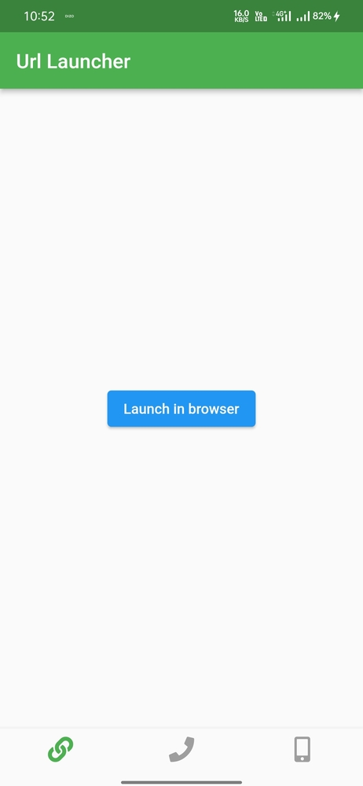
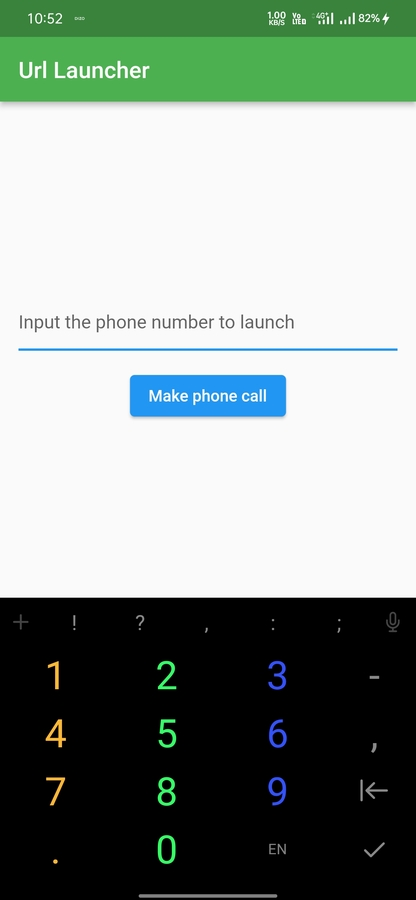
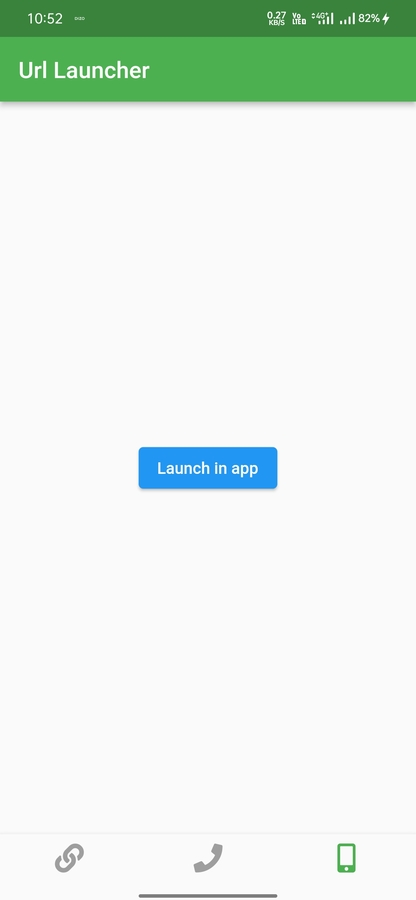

# url_launch

url launcher in flutter app

Package :

url_launcher: ^6.0.15
import 'package:url_launcher/url_launcher.dart';

dependancy
https://pub.dev/packages/url_launcher

https://user-images.githubusercontent.com/73890321/143763066-a7607d13-3898-476a-a710-179fbab8a53f.mp4

  

## Getting Started

This project is a starting point for a Flutter application.

A few resources to get you started if this is your first Flutter project:

- [Lab: Write your first Flutter app](https://flutter.dev/docs/get-started/codelab)
- [Cookbook: Useful Flutter samples](https://flutter.dev/docs/cookbook)

For help getting started with Flutter, view our
[online documentation](https://flutter.dev/docs), which offers tutorials,
samples, guidance on mobile development, and a full API reference.
